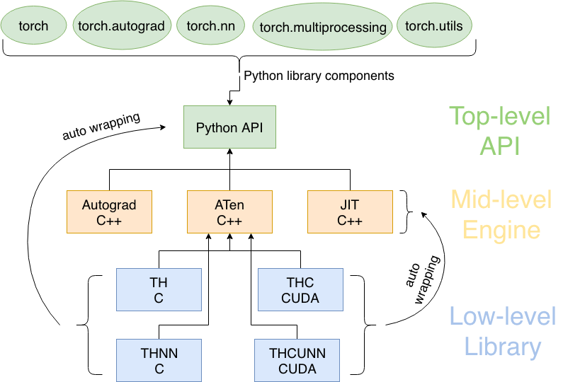
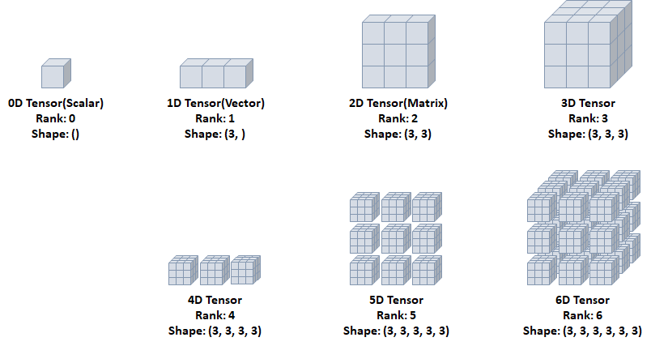
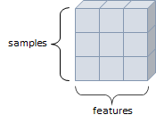
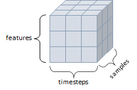
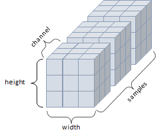
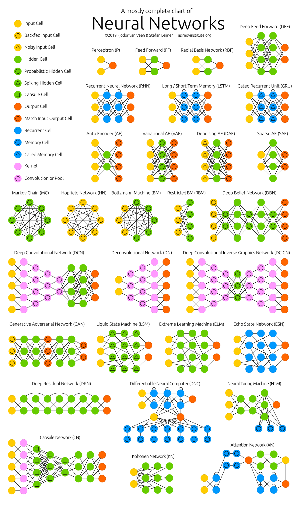

# PyTorch

- 페이스북이 초기 루아(Lua) 언어로 개발된 토치(Torch)를 파이썬 버전으로 개발하여 2017년도에 공개
- 초기에 토치(Torch)는 넘파이(NumPy) 라이브러리처럼 과학 연산을 위한 라이브러리로 공개
- 이후 GPU를 이용한 텐서 조작 및 동적 신경망 구축이 가능하도록 딥러닝 프레임워크로 발전시킴
- 파이썬 답게 만들어졌고, 유연하면서도 가속화된 계산 속도를 제공

[Code 보기](#PyTorch-Code)

파이토치 모듈 구조



## 파이토치의 구성 요소

- `torch` : 메인 네임스페이스, 텐서 등의 다양한 수학 함수가 포함
- `torch.autograd` : 자동 미분 기능을 제공하는 라이브러리
- `torch.nn` : 신경망 구축을 위한 데이터 구조나 레이어 등의 라이브러리
- `torch.multiprocessing` : 병렬처리 기능을 제공하는 라이브러리
- `torch.optim` : SGD(Stochastic Gradient Descent)를 중심으로 한 파라미터 최적화 알고리즘 제공
- `torch.utils` : 데이터 조작 등 유틸리티 기능 제공
- `torch.onnx` : ONNX(Open Neural Network Exchange), 서로 다른 프레임워크 간의 모델을 공유할 때 사용

## 텐서(Tensors)

- 데이터 표현을 위한 기본 구조로 텐서(tensor)를 사용
- 텐서는 데이터를 담기위한 컨테이너(container)로서 일반적으로 수치형 데이터를 저장
- 넘파이(NumPy)의 ndarray와 유사
- GPU를 사용한 연산 가속 가능



## 데이터 타입

| Data type | dtype | CPU tensor | GPU tensor |
| --- | --- | --- | --- |
| 32-bit floating point | `torch.float32` or `torch.float` | `torch.FloatTensor` | `torch.cuda.FloatTensor` |
| 64-bit floating point | `torch.float64` or `torch.double` | `torch.DoubleTensor` | `torch.cuda.DoubleTensor` |
| 16-bit floating point | `torch.float16` or `torch.half` | `torch.HalfTensor` | `torch.cuda.HalfTensor` |
| 8-bit integer(unsinged) | `torch.uint8` | `torch.ByteTensor` | `torch.cuda.ByteTensor` |
| 8-bit integer(singed) | `torch.int8` | `torch.CharTensor` | `torch.cuda.CharTensor` |
| 16-bit integer(signed) | `torch.int16` or `torch.short` | `torch.ShortTensor` | `torch.cuda.ShortTensor` |
| 32-bit integer(signed) | `torch.int32` or `torch.int` | `torch.IntTensor` | `torch.cuda.IntTensor` |
| 64-bit integer(signed) | `torch.int64` or `torch.long` | `torch.LongTensor` | `torch.cuda.LongTensor` |

## CUDA Tensors

- `.to` 메소드를 사용하여 텐서를 어떠한 장치(CPU, GPU)로도 옮길 수 있음

```python
# torch.device() 는 'cuda'를 넣으며 GPU, 'cpu'를 넣으면 CPU가 됨
device = torch.device('cuda' if torch.cuda.is_available() else 'cpu')
x = x.to(device) # x 가 CPU 일 때 .to(device)를 해줌으로서 GPU로 변
```

## 다차원 텐서 표현

### 0D Tensor(Scalar)

- 하나의 숫자를 담고 있는 텐서(tensor)
- 축과 형상이 없음

### 1D Tensor(Vector)

- 값들을 저장한 리스트와 유사한 텐서
- 하나의 축이 존재

### 2D Tensor(Matrix)

- 행렬과 같은 모양으로 두 개의 축이 존재
- 일반적인 수치, 통계 dataset 이 해당
- 주로 샘플(samples)과 특성(features)을 가진 구조로 사용



### 3D Tensor

- 큐브(cube)와 같은 모양으로 세개의 축이 존재
- 데이터가 연속된 시퀀스 데이터나 시간 축이 포함된 시계열 데이터에 해당
- 주식 가격 데이터셋, 시간에 따른 질병 발병 데이터 등이 존재
- 주로 샘플(samples), 타임스텝(timesteps), 특성(features)을 가진 구조로 사용



### 4D Tensor

- 4개의 축
- 컬러 이미지 데이터가 대표적인 사례 (흑백 이미지 데이터는 3D Tensor로 가능)
- 주로 샘플(samples), 높이(height), 너비(width), 컬러 채널(channel)을 가진 구조로 사용



### 5D Tensor

- 5개의 축
- 비디오 데이터가 대표적인 사례
- 주로 샘플(samples), 프레임(frames), 높이(height), 너비(width), 컬러 채널(channel)을 가진 구조로 사용

## 텐서의 연산(Operations)

- 텐서에 대한 수학 연산, 삼각함수, 비트 연산, 비교 연산, 집계 등 제공
- `max`와 `min`은 `dim` 인자를 줄 경우 `argmax` 와 `argmin`도 함께 리턴
    - `argmax` : 최대 값을 가진 인덱스
    - `argmin` : 최소 값을 가진 인덱스
- in-place 방식으로 텐서의 값을 변경하는 연산 뒤에는 _(under bar)가 붙음
    - `x.copy_(y)`, `x.t_()`

## 텐서의 조작

- 인덱싱(Indexing) : NumPy처럼 인덱싱 형태로 사용 가능
- `view` : 텐서의 크기(size)나 모양(shape)을 변경
    - 기본적으로 변경 전과 후에 텐서 안의 원소 개수가 유지되어야 함
    - -1로 설정되면 계산을 통해 해당 크기 값을 유
- torch ↔ numpy
    - Torch Tensor(텐서)를 NumPy array(배열)로 변환 가능
        - `numpy()`
        - `from_numpy()`
- Tensor가 CPU상에 있다면 NumPy 배열은 메모리 공간을 공유하므로 하나가 변하면, 다른 하나도 변

## Autograd(자동미분)

- `torch.autograd` 패키지는 Tensor의 모든 연산에 대해 **자동 미분** 제공
- 이는 코드를 어떻게 작성하여 실행하느냐에 따라 역전파가 정의된다는 뜻
- `backprop` 를  위해 미분 값을 자동으로 계산

`reqires_grad` 속성을 `True` 로 설정하면, 해당 텐서에서 이루어지는 모든 연산들을 추적하기 시작

기록을 추적하는 것을 중단하게 하려면, `.detach()` 를 호출하여 연산 기록으로부터 분리

`requires_grad_(…)` 는 기존 텐서의 `requires_grad` 값을 바꿔치기(`in-place`)하여 변경

`grad_fn` : 미분값을 계산한 함수에 대한 정보 저장 (어떤 함수에 대해서 backprop 했는지)

계산이 완료된 후, `.backward()` 를 호출하면 자동으로 역전파 계산이 가능하고, `.grad` 속성에 누적

`with torch.no_grad()` 를 사용하여 기울기의 업데이트를 하지 않음

기록을 추적하는 것을 방지하기 위해 코드 블럭을 `with torch.no_grad()` 로 감싸면 기울기 계산은 필요 없지만, `requires_grad=True` 로 설정되어 학습 가능한 매개변수를 갖는 모델을 평가(evaluate)할 때 유

## 자동 미분 흐름 예제

- 계산 흐름 $a$ → $b$ → $c$ → $out$

 $\frac{\partial out}{\partial a} = ?$

- `backward()` 를 통해 $a$ ← $b$ ← $c$ ← $out$을 계산하면  $\frac{\partial out}{\partial a}$값이 `a.grad` 에 채워짐

## 데이터 준비

파이토치에서는 데이터 준비를 위해 `torch.utils.data`의 `Dataset`과 `DataLoader` 사용 가능

- `Dataset`에는 다양한 데이터셋이 존재 (MNIST, FashionMNIST, CIFAR10, ...)
    - Vision Dataset: https://pytorch.org/vision/stable/datasets.html
    - Text Dataset: https://pytorch.org/text/stable/datasets.html
    - Audio Dataset: https://pytorch.org/audio/stable/datasets.html
- `DataLoader`와 `Dataset`을 통해 `batch_size`, `train` 여부, `transform` 등을 인자로 넣어 데이터를 어떻게 load할 것인지 정해줄 수 있음

토치비전(torchvision)은 파이토치에서 제공하는 데이터셋들이 모여있는 패키지

- `transforms`:전처리할 때 사용하는 메소드
- `transforms`에서 제공하는 클래스 이외는 일반적으로 클래스를 따로 만들어 전처리 단계를 진행 진행

`DataLoader`의 인자로 들어갈 `transform`을 미리 정의할 수 있고, `Compose`를 통해 리스트 안에 순서대로 전처리 진행

`ToTensor`()를 하는 이유는 `torchvision`이 PIL Image 형태로만 입력을 받기 때문에 데이터 처리를 위해서 Tensor형으로 변환 필요

`DataLoader`는 데이터 전체를 보관했다가 실제 모델 학습을 할 때 `batch_size` 크기만큼 데이터를 가져옴

## 신경망 구성

- 레이어(layer): 신경망의 핵심 데이터 구조로 하나 이상의 텐서를 입력받아 하나 이상의 텐서를 출력
- 모듈(module): 한 개 이상의 계층이 모여서 구성
- 모델(model): 한 개 이상의 모듈이 모여서 구성

### 컨볼루션 레이어(Convolution Layers)

`nn.Conv2d` 예제

- `in_channels`: channel의 갯수
- `out_channels`: 출력 채널의 갯수
- `kernel_size`: 커널(필터) 사이즈

### **풀링 레이어(Pooling layers)**

- `F.max_pool2d`
    - `stride`
    - `kernel_size`
- `torch.nn.MaxPool2d` 도 많이 사용

• MaxPool Layer는 weight가 없기 때문에 바로 `numpy()`변환 가능

### **선형 레이어(Linear layers)**

1d만 가능하므로 `.view()`를 통해 1d로 펼쳐줘야함

### **비선형 활성화 (Non-linear Activations)**

`F.softmax`와 같은 활성화 함수 등

`F.relu`

- ReLU 함수를 적용하는 레이어
- `nn.ReLU`로도 사용 가능

## **신경망 종류**



## **모델 정의**

### **`nn.Module` 상속 클래스 정의**

- `nn.Module`을 상속받는 클래스 정의
- `__init__()`: 모델에서 사용될 모듈과 활성화 함수 등을 정의
- `forward()`: 모델에서 실행되어야 하는 연산을 정의

### **`nn.Sequential`을 이용한 신경망 정의**

- `nn.Sequential` 객체로 그 안에 각 모듈을 순차적으로 실행
- `__init__()`에서 사용할 네트워크 모델들을 `nn.Sequential`로 정의 가능
- `forward()`에서 실행되어야 할 계산을 가독성 높게 작성 가능

## **모델 파라미터**

### **손실 함수(Loss function)**

- 예측 값과 실제 값 사이의 오차 측정
- 학습이 진행되면서 해당 과정이 얼마나 잘 되고 있는지 나타내는 지표
- 모델이 훈련되는 동안 최소화될 값으로 주어진 문제에 대한 성공 지표
- 손실 함수에 따른 결과를 통해 학습 파라미터를 조정
- 최적화 이론에서 최소화 하고자 하는 함수
- 미분 가능한 함수 사용
- 파이토치의 주요 손실 함수
    - `torch.nn.BCELoss`: 이진 분류를 위해 사용
    - `torch.nn.CrossEntropyLoss`: 다중 클래스 분류를 위해 사용
    - `torch.nn.MSELoss`: 회귀 모델에서 사용

### **옵티마이저(Optimizer)**

- 손실 함수를 기반으로 모델이 어떻게 업데이트되어야 하는지 결정 (특정 종류의 확률적 경사 하강법 구현)
- optimizer는 `step()`을 통해 전달받은 파라미터를 모델 업데이트
- 모든 옵티마이저의 기본으로 `torch.optim.Optimizer(params, defaults)` 클래스 사용
- `zero_grad()`를 이용해 옵티마이저에 사용된 파라미터들의 기울기를 0으로 설정
- `torch.optim.lr_scheduler`를 이용해 에포크(epochs)에 따라 학습률(learning rate) 조절
- 파이토치의 주요 옵티마이저: `optim.Adadelta`, `optim.Adagrad`, `optim.Adam`, `optim.RMSprop`, `optim.SGD`

# ⌨️ PyTorch Code

### Code Contents
- PyTorch Basic
- Neural Network Basic
- MNIST Model
- CIFAR Model

<details>
<summary>PyTorch.ipynb</summary>
  
  - Tensor Initalize
  - Data Type
  - CUDA Tensor
  - Multidimensional Tensor Representation
  - Tensor Operations
  - Tensor Manipulations
  - Autograd(자동미분)
  - Gradient
  - Example of Autograd Flow

  ---
  **Use Examples**
  - Data
    - Vision Dataset : https://pytorch.org/vision/stable/datasets.html
    - Text Dataset : https://pytorch.org/text/stable/datasets.html
    - Audio Dataset: https://pytorch.org/audio/stable/datasets.html
  - Neural Network
  - Convolution Layers
  - Pooling layers
  - Linear Layers
  - Non-linear Activations
  - Model
  - `nn.Sequential`
  - Model Parameter
    - Loss function
    - Optimizer
    - Metrics
  - Linear Regression Model
  - FashionMNIST Classification Model
</details>
<details>
  <summary>PyTorch_Neural_Network_Generation.ipynb</summary>

  - Neural Network Generation
    - Neural Network
    - Linear Regression Model Generation
  - Linear Regression Model
</details>
<details>
  <summary>PyTorch_MNIST_Model.ipynb</summary>

  - PyTorch MNIST Model
    - Modules import
    - Preprocessing
    - Data load
    - Neural Network
    - Train Model
    - Model save & load
    - Test Model
    - GPU Train Model
</details>
